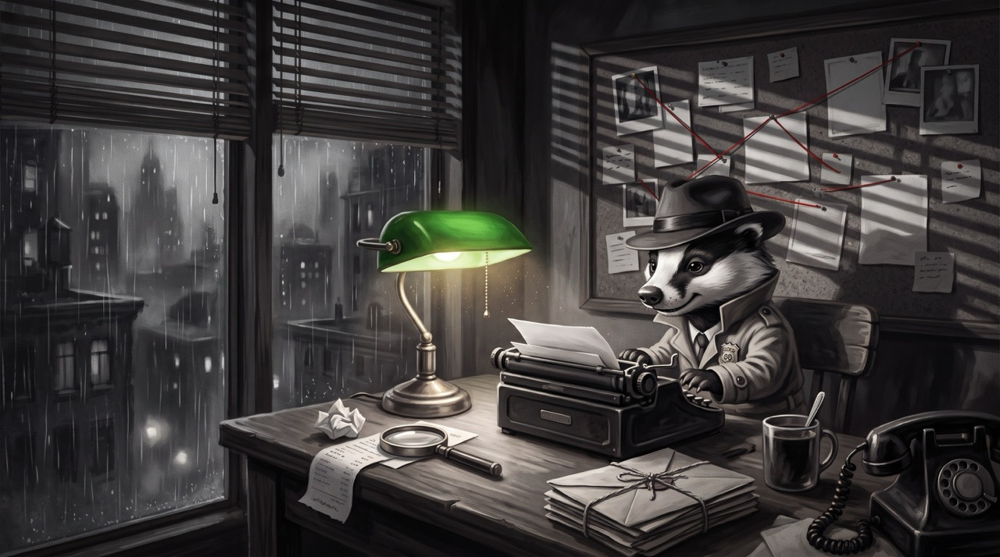

# 💸 Refund Prompt

A single, self-contained prompt that turns Claude, ChatGPT, or any other capable AI into your personal refund assistant. Paste it, attach your receipt, answer a couple of questions — and get a letter built to get approved, plus a ready-made escalation plan in case it isn't. If you have no real case, it tells you so honestly instead of bluffing.

No lawyer, no templates to fill in. 🙌

👉 **The prompt lives here: [`PROMPT.md`](PROMPT.md)**

## 🚀 Usage

1. Copy the entire contents of [`PROMPT.md`](PROMPT.md).
2. Paste it into Claude, ChatGPT, or any other capable AI.
3. Attach your receipt when asked. Answer the few questions the documents can't.
4. Send the phase-1 letter where the AI tells you — it finds the company's real support channel itself. If they refuse or stall, come back for the escalation letter. ✅

Using Claude Code, Codex, Cursor or another coding agent? Install it as a skill instead:

```bash
npx skills add paveldevyatov/refund-anything-ai-prompt
```

It installs as `get-refund` and starts when you ask for a refund (or run `/get-refund` in Claude Code).

## ⚙️ How it works

The prompt runs a deliberate two-phase strategy. Most refunds die because people skip straight to threats — this one doesn't.

### 🕊️ Phase 1 — Research, then a polite letter

The AI does the homework before writing a single line:

- 📄 **Reads your documents.** Receipt, invoice, emails, screenshots — it extracts the company, the amount, the dates, the payment method, and anything already working in your favor.
- 🔍 **Investigates the company.** It studies their live website: refund policy, terms of service, cancellation windows. If their own policy says you qualify, that goes front and center — a support agent can approve a policy-based refund with the button they already have.
- ✉️ **Writes the letter.** Short, polite, cooperative, and explicit that you want to settle this amicably, without conflict. No legal threats — those only route your ticket to a slower queue. If you hold an ironclad legal argument (say, an EU resident inside the 14-day withdrawal window), it appears as one soft sentence at the end, nothing more.

### ⚖️ Phase 2 — Escalation, with the law behind it

If they refuse or stall, ask for the second letter — same facts, still polite, but now resting on the strongest legal ground that fits your case:

- 📜 the exact consumer-protection statutes for your country and situation, with article numbers;
- 🏛️ the specific complaints you will file and with which named bodies — regulator, ombudsman, card issuer — if the refund isn't processed by a stated date;
- 🪜 the full escalation ladder: formal complaint → consumer authority → card chargeback → small claims, with the deadlines that quietly expire while polite emails go back and forth.

## 🌍 What's inside

The prompt carries its own compact legal reference for 45+ jurisdictions, spot-checked against official sources in October 2026 (verify before you rely on it) — EU/EEA with national laws for Germany, France, Spain, Italy, the Netherlands and Poland, UK, US, Canada, Latin America, Russia, Ukraine, Kazakhstan, the Middle East, Africa, India, China, Japan, and more — so the model cites the right statute for your country and your reason, and never a mismatched one: a wrong citation invites a rebuttal that discredits the whole letter.

## ⚠️ Disclaimer

This is not legal advice. The AI can get facts or statutes wrong, and laws change — check the key citations and deadlines yourself before you send anything, and talk to a lawyer if a lot of money is at stake.

## 📄 License

[MIT](LICENSE)
